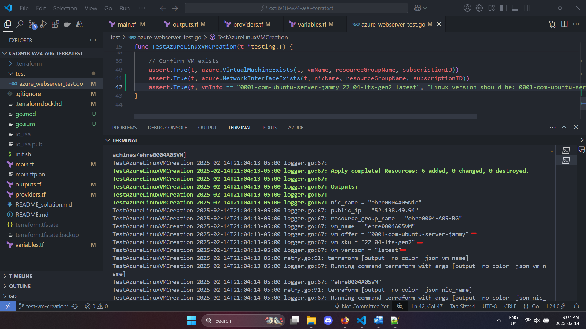
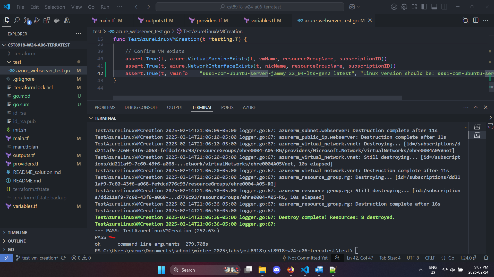

# Screenshots of unit test performance

The unit tests and its additions:

```Go
// Run `terraform output` to get the value of output variable
vmName := terraform.Output(t, terraformOptions, "vm_name")
nicName := terraform.Output(t, terraformOptions, "nic_name")
resourceGroupName := terraform.Output(t, terraformOptions, "resource_group_name")
vmInfo, something := azure.GetVirtualMachineImageE(vmName, resourceGroupName, subscriptionID)
println(something) // needed for "unused" error for something

// Confirm VM exists
assert.True(t, azure.VirtualMachineExists(t, vmName, resourceGroupName, subscriptionID))
assert.True(t, azure.NetworkInterfaceExists(t, nicName, resourceGroupName, subscriptionID))
assert.True(t, (vmInfo.SKU+" "+vmInfo.Version) == "22_04-lts-gen2 latest", "version should be 22_04-lts-gen2 latest")
```

Outcome of running `go test -v azure_webserver_test.go`:


