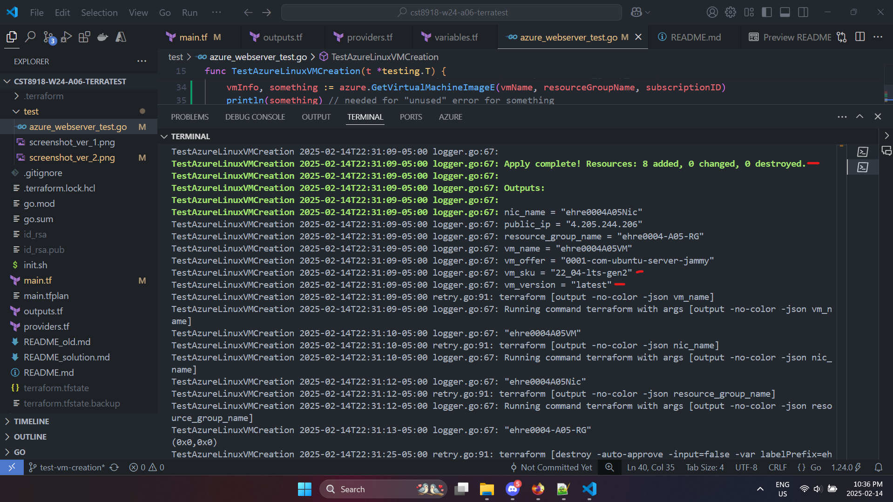
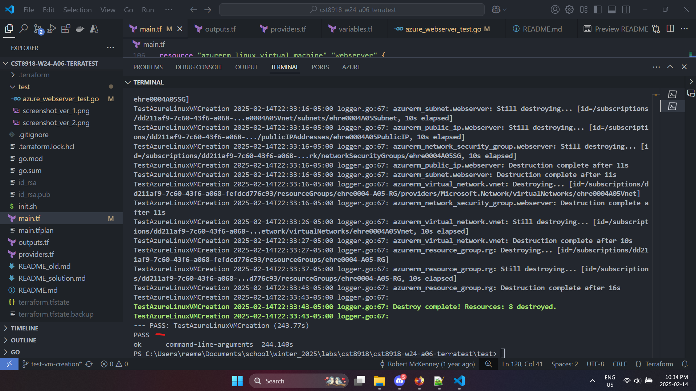

# Screenshots of unit test performance

The unit tests and its additions:

```Go
vmName := terraform.Output(t, terraformOptions, "vm_name")
nicName := terraform.Output(t, terraformOptions, "nic_name")        // addition 1: the NIC's name
vmOffer := terraform.Output(t, terraformOptions, "vm_offer")        // addition 2-a: the offer name
vmSku := terraform.Output(t, terraformOptions, "vm_sku")            // addition 2-b: the SKU
vmVersion := terraform.Output(t, terraformOptions, "vm_version")    // addition 2-c: the version e.g. latest
vmInfo := vmOffer + " " + vmSku + " " + vmVersion                   // addition 2-d: concatenate A to C
resourceGroupName := terraform.Output(t, terraformOptions, "resource_group_name")

// Confirm VM exists
assert.True(t, azure.VirtualMachineExists(t, vmName, resourceGroupName, subscriptionID))
assert.True(t, azure.NetworkInterfaceExists(t, nicName, resourceGroupName, subscriptionID)) // check NIC exists
assert.True(t, vmInfo == "0001-com-ubuntu-server-jammy 22_04-lts-gen2 latest", "Linux version should be: 0001-com-ubuntu-server-jammy 22_04-lts-gen2 latest") // check version of linux (and other info)
```

Outcome of running `go test -v azure_webserver_test.go`:


